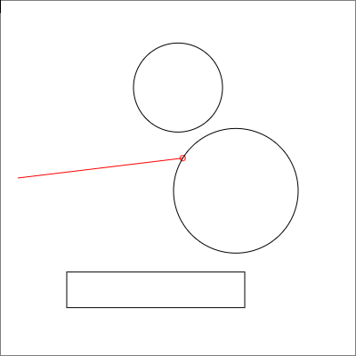
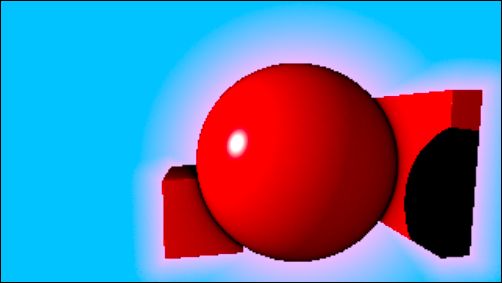

# Raymarching

Raymarching is a rendering method in which rays are "marched" from light sources until they hit something.
The path the light ray travels and what it hits affect how the pixel is rendered.
To run the examples, open `index.html` or `index3D.html` in your browser.

## 2D Raymarching
`index.html` runs an interactive 2D raymarching world, where the algorithm is used to determine when a ray hits a shape. 

## 3D Raymarching
`index3D.html` runs an interactice 3D raymarching experience. Here, raymarching is used to render shapes, shadows,
specular and diffuse reflections, and glow. The player can be controlled in real time with WASD, SHIFT, and SPACE,
and the mouse to look around.

