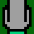

# WaveFunction Collapse

Inspired by the video tutorial [Coding Challenge 171: Wave Function Collapse](https://www.youtube.com/watch?v=rI_y2GAlQFM),
I set out to program the wave function collapse algorithm in C++, instead of the tutorial's original JavaScript.

### Overview

Wave function collapse takes inspiration from quantum mechanics to procedurally generate interesting and unique patterns.
For example, the circuit board above is made of 13 unique tiles, which can only connect to other tiles with a matching edge.
These tiles are shown below. Tiles can be rotated to provide additional possibilities.

When tiles are laid down in part of the pattern, this limits the possible options of the neighboring tiles. The algorithm
proceeds by selecting empty spaces with the lowest entropy (smallest number of possibilities), and "collapses" the space
by randomly picking a tile from the set of possible tiles. Eventually, the whole image collapses into one of many possible patterns.

### Considerations

There is a chance that the algorithm encounters a situation where no tile can correctly fill a space. In these instances,
a simple solution is to restart the process from the beginning.

For displaying images, I use the basic functionality of Mats from OpenCV. I have extensive OpenCV experience in Python,
and wanted to build proficiency in C++ as well.
